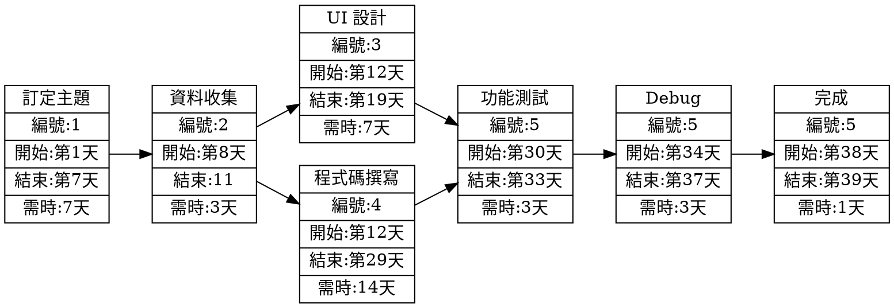

PERT

```graphviz
digraph {
	node[shape=record];
	rankdir="LR";
    no1 [label = "訂定主題 | 編號:1 | 開始:第1天 | 結束:第7天 | 需時:7天"]
    
    no2 [label = "資料收集 | 編號:2 | 開始:第8天 | 結束:11 | 需時:3天"]
    
    no1->no2
    
    no3 [label = "UI 設計 | 編號:3 | 開始:第12天 | 結束:第19天 | 需時:7天"]
   
    no4 [label = "程式碼撰寫 | 編號:4 | 開始:第12天 | 結束:第29天 | 需時:14天"]
    
    {rank=same;no3 no4}
    no2->no3
    no2->no4
    
    no5 [label = "功能測試 | 編號:5 | 開始:第30天 | 結束:第33天 | 需時:3天"]

    no3->no5
    no4->no5
    
    
    no6 [label = "Debug | 編號:5 | 開始:第34天 | 結束:第37天 | 需時:3天"]

    no5->no6
    
    no7 [label = "完成 | 編號:5 | 開始:第38天 | 結束:第39天 | 需時:1天"]

    no6->no7
    
}
```
